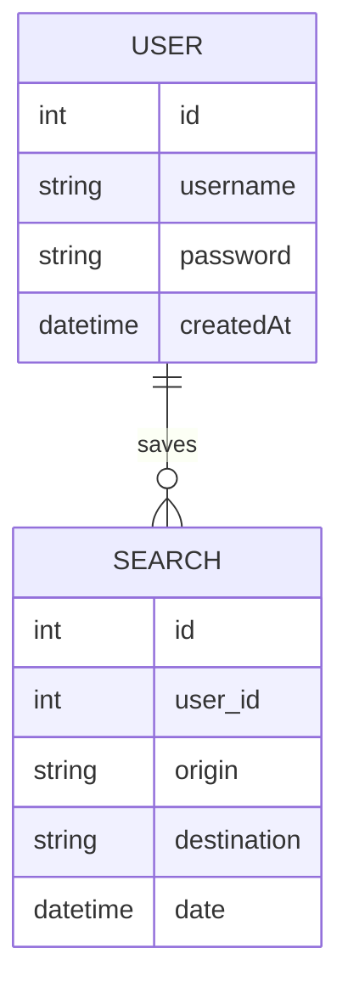

# Database Schema Template

_What are the main entities and relationships in your data model?_

---

## ER Diagram

<small>(Example diagram. Expand for your actual model.)</small>

---

## Description

The main entity is `USER`, which provides minimal account features (username, password, no email/phone required). Users may save or view previous flight searches (`SEARCH`). For MVP, booking is out of scope; only search and basic account features are included.

---

<small>Add more entities and relationships as your project grows (e.g., hotel/tour bookings).</small>
